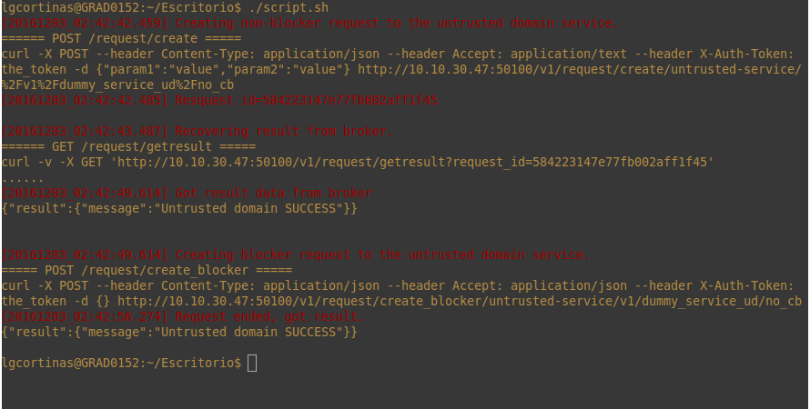

# Contents of the WITDOM Broker core component repository

## Directory listing
The broker repository contains the following directories and files (not all the files in subdirectories are listed):
 - api
   - swagger.yaml (Api specification in swagger format)
 - blueprints (directory with blueprint prototypes for deploying the trusted and untrusted brokers with some dummy services)
 - certs (server and ca certificates for testing)
 - CAs (several self-signed CAs (along signed server and client certificates) created with testing purposes, and also instructions to create new ones)
 - config (broker configuration)
 - controllers (nodejs controllers for servicing request to the broker)
 - dependencies (this directory is a git submodule that clones the IAM repository for access the IAM javascript client module)
 - models (mongoose database models)
 - orchestration (default orchestration connection modules)
 - protection (default protection orchrestrator communication module)
 - request_forwarding (broker's core module)
 - tests (nodejs tests and java api client library with example calls)
   - nodejs
   - java
 - utils (nodejs server handlers)
    - validators (this directory contains 'dummyTokenValidation' that serves as an example on how to create a module to connect to a different token validation service)
 - broker.js
 - Dockerfile
 - dockerFileCustom.js (a custom config file for replacing 'config/custom.js' when building the Dockerfile)
 - package.json
 - README.md (this file)


## Broker configuration
WITDOM broker component uses JSON style configurariton files. The default configuration is inside 'config/default.js', a custom configuration can be entered by providing the desired fields in the file 'config/custom.js'.

### Database
The database must be up and running before launching the broker. By default it points to 'mongo:27017', as this is the way it works on docker by linking containers. You can enter different configuration in the 'config/custom.js' file.
```
database: {
    host: 'mongo',
    port: '27017'
}
```

### Orchestration
There are two included orchestration modules, one for Cloudify and other for testing/example.
#### To load the example:
```
    orchestrator: {
        name: 'mock_example',
        config: {
            services: {
                service1: {
                    host: "host1",
                    port: "port1"
                },
                service2: {
                    host: "host2",
                    port: "port2"
                }
            }
        }
    }
```
The module will create a service for each one defined inside services, and will use the host and port defined.
#### To load the one which communicates with Cloudify
```
    orchestrator: {
        name: 'cloudify_provider_connector',                    // Installed module name to import
        config: {
            protocol: 'http',                                   // Connection protocol
            host: 'localhost',                                  // Cloudify API host
            port: '1234',                                       // Cloudify API port
            auth_token: 'some token',                           // Auth mechanism (TBD)
            certificate_key: './CAs/witdomCA/client1_key.pem',  // Client certificate key
            certificate: './CAs/witdomCA/client1_crt.pem',      // Client certificate
            ca: './CAs/witdomCA/witdomcacert.pem'               // Client trusted CA
        }
    }
```
This module looks for outputs in all cloudify deployments. In orded to be recognized, the outputs in the cloudify blueprint must be defined in this format.
```
outputs:
  service-name:
    value:
      description: W1 Description trusted-service
      host: {get_attribute: [example_node, w1_ip_address]}
      port: {get_attribute: [example_node, w1_internal_port]}
      image: {get_attribute: [example_node, w1_image_url]}
      name: {get_attribute: [example_node, w1_name]}
```

## Local deployment of the broker with nodejs
For locally deploying the broker just run the following command:
```
$ npm start
```

It will install all the needed dependencies and start the broker with the configuration inside the config directory. 

## Deployment of the broker with Dockerfile
First edit the files 'broker_td_custom_config.js' and 'broker_ud_custom_config.js' to configure the tusted domain broker and untrusted domain broker. The ports of the broker and the configuration of the certificates can be also be set up in this file.
Then edit the 'broker_docker.sh' script and set 'DOCKER_HOST_IP'
```
DOCKER_HOST_IP="10.5.1.120"
```
Then build the docker image for the trusted broker:
```
./broker_docker.sh --command=rebuild-images --dockerfile=Dockerfile_td --image-name=witdom-core-broker-td --container-name=broker_td
```
And for the untrusted broker:
```
./broker_docker.sh --command=build-images --dockerfile=Dockerfile_ud --image-name=witdom-core-broker-ud --container-name=broker_ud
```
The broker needs a running instance a running instance of the IAM.

Then run the mongo container
```
$ docker run --name mongo-broker -d mongo
```

Then run the trusted docker container:
```
./broker_docker.sh --command=run-containers --image-name=witdom-core-broker-td --container-name=broker_td --mongo-container=mongo-broker-td --container-http-port=5000 --container-https-port=5043 --host-http-port=5000 --host-https-port=5043 --remote-host=localhost --remote-http-port=5100 --remote-https-port=5143 --other-domain-name=broker-ud --use-iam=yes --iam-container=iam
```
And the untrusted docker container:
```
./broker_docker.sh --command=run-containers --image-name=witdom-core-broker-ud --container-name=broker_ud --mongo-container=mongo-broker-ud --container-http-port=5000 --container-https-port=5043 --host-http-port=5100 --host-https-port=5143 --remote-host=localhost --remote-http-port=5000 --remote-https-port=5043 --other-domain-name=broker-td
```

If the instance of the IAM is run in a container inside the same docker host as the broker, run the broker container with the following command to link the broker container to the IAM container
```
$ docker run --name broker -p 5000:5000 -p 5043:5043 --link mongo-broker:mongo --link iam_container:iam_host_name -d witdom-core-broker
``` 

To stop the trusted container:
```
./broker_docker.sh --command=stop-containers --container-name=broker_td
```
Same for the untrusted container:
```
./broker_docker.sh --command=stop-containers --container-name=broker_ud
```

To start the containers again
```
./broker_docker.sh --command=start-containers --container-name=broker_td
./broker_docker.sh --command=start-containers --container-name=broker_ud
```

To fresh start the container from the image first run (with the container stopped)
```
$ docker rm broker_td
$ docker rm broker_ud
```

And then run it again with the 'docker run' command

Prior building the docker image it is possible to change the default configuration of the broker by editing the file 'config/custom.js'. (now it is done through the file 'dockerFileCustom.js', may be changed in future commits)
For example to change the port of the HTTP connector put the following content in the file:

```javascript
module.exports = {
    http: { port: 5000 }
};
```
If the default port configuration is changed it has to be updated also in the Dockerfile

```
EXPOSE <http_port>
EXPOSE <https_port>
```

And also change the command for running the docker container as follows:
```
$ docker run -name broker -p <http_port>:<http_port> -p <https_port>:<https_port> -d witdom-core-broker
```


## Launching nodejs unit tests

### Broker deployed locally
Prior to launching the tests the HTTP and HTTPS ports must be configured if the default ports have been changed in the running broker. To do this edit the file `tests/nodejs/config/custom.js` with the following content, changing the ports to the right values:

```javascript
module.exports = {
    http: { port: 5000 },
    https: {
        port: 5043,
    }
};
```
These tests also check the functionality of mutual identification with client and server certificates. The CA and client certs to use in the tests can also be configured in the file `tests/config/custom.js` this way:

```javascript
module.exports = {
    https: {
        ca_cert: 'CAs/witdomCA/witdomcacert.pem' // The CA certificate used to verify the server certificate
        right_client_key: 'CAs/witdomCA/client1_key.pem', // The key of valid client in the CA
        right_client_cert: 'CAs/witdomCA/client1_crt.pem', // The certificate of a valid client in the CA
        wrong_client_key: 'CAs/untrustedCA/untrusted_client_key.pem', // The key of an invalid client in CA
        wrong_client_cert: 'CAs/untrustedCA/untrusted_client_crt.pem', // The certificate of a invalid client in the CA
    }
};
``` 
The library used to do the tests ('supertest') doesn't support the configuration of client certificates yet but it will in the next library release as is stated [here](https://github.com/visionmedia/supertest/pull/373).
In the mean time the library can be patched by editing the file 'lib/agent.js' according to what is explained in the link so the mutual identification tests pass.

To launch the tests just run the following command:
```
$ npm test
```

### Broker deployed in Docker containter

To launch the nodejs test using the broker in the docker container use the same procedure as in the locally deployed broker, that is, change the default test configuration in `tests/config/custom.js` and run the command:
```
$ npm test
``` 

## Launching java API tests

The Java tests are inside the directory tests/java. This directory contains a maven script 'pom.xml' that can be used to compile and package the API client library and to run the example tests.
Apache maven 3.3.3 or greater is needed to build the API client library and run the tests.
To build the API client library run the following command:
```
$ mvn package
```
This will generate the files `swagger-java-client-1.0.0.jar` and `swagger-java-client-1.0.0-tests.jar`. The first file contains the API client library and the second one contains the API client tests that serve as an example of how invoke the broker REST API using the API client library.
The test classes are contained in `tests/java/src/test/java/eu/witdom/core/broker/client/api/`, there are 4 test classes, `HTTPSApiTest.java`, `ForwardApiTest.java`, `RequestApiTest.java` and `ServicesApiTest.java`. The first one makes the request to the broker API using HTTPS and the rest use HTTP.

### Trust store creation
For validating the server certificate (if it is an autogenerated self-signed certificate) we need to create a trust store and import in the server certificate. To do this run the following command:
```
$ keytool -import -alias <alias_of_ca_cert> -file <ca_cert_file> -keystore <trust_store_name>
```
A prompt will appear requesting a password for the new trust store.
After creating the trust store it can be used passing the following arguments to the JVM when invoking it:
```
-Djavax.net.ssl.trustStore=<path/to/truststorefile> -Djavax.net.ssl.trustStorePassword=<truststorepassword>
```
It is also possible to set this parameters in Java code before creating the first instance of the class `ApiClient` (each of the API classes, `ForwardApi`, `RequestApi` and `ServiceApi`, use this class internally):
```java
System.setProperty("javax.net.ssl.trustStore",path_to_truststore);
System.setProperty("javax.net.ssl.trustStorePassword",truststorepassword);
```

### Key store creation
For the mutual authentication a client certificate must be provided to the broker along the request. This certificate is read by a Java application from the selected key store. The java 'keytool' command can't be used to directly create this key store because it doesn't allow to import a key when generating the key store, the only option is to create a new key along the key stotre creation. So the openssl tool is used to create the new key store in PKCS12 format and to import into it the client key and certificate. First the client key and the client certificate must be concatenated in one file:
```
$ cat <client_key_file> <client_crt_file> > client_key_crt.pem
```
After that to create the PKCS12 key store use the following command:
```
$ openssl pkcs12 -export -in client_key_crt.pem -out client_keystore.pkcs12 -name client -noiter -nomaciter
```
Where `-name client` indicates an alias for the key_cert inside the key store. After executing this command a prompt requesting a password for the key store will appear. After creating the key store it can be converted from PKCS12 to JKS format with the following command:
```
$ keytool -importkeystore -deststorepass <password_of_jks_keystore> -destkeypass <password_of_the_key_in_jks> -destkeystore <jks_file> -srckeystore <pkcs12_file> -srcstoretype PKCS12 -srcstorepass <pkcs12_passwrod> -alias client
```
Use the same password for `-deststorepass`  and `-destkeypass`, and for `-alias` use the same value as in `-name` for the 'openssl' command. To use the created key store in a Java application the JVM must be invoked with the following params for the case of the PKCS12 format:
```
$ -Djavax.net.ssl.keyStore=<path/to/keystorefile.pkcs12> -Djavax.net.ssl.keyStorePassword=<keystorepassword> -Djavax.net.ssl.keyStoreType=PKCS12
```
And for the case of JKS format:
```
$ -Djavax.net.ssl.keyStore=<path/to/keystorefile.jks> -Djavax.net.ssl.keyStorePassword=<keystorepassword>
```
Again, it is also possible to set this parameters in Java code before creating the first instance of the class `ApiClient`:
```java
System.setProperty("javax.net.ssl.keyStore",path_to_keystore);
System.setProperty("javax.net.ssl.keyStorePassword",keystorepassword);
System.setProperty("javax.net.ssl.keyStoreType",type_of_keystore);  //Possible values 'JKS' or 'PKCS12'
```

A preconfigured truststore is provided in the file `tests/java/truststore/truststorefile`, and two keystores (both in PKCS12 and JKS format )in the files `tests/java/keystore/trusted_client_keystore.pkcs12`, `tests/java/keystore/trusted_client_keystore.jks`, `tests/java/keystore/untrusted_client_keystore.pkcs12` and `tests/java/keystore/untrusted_client_keystore.jks`. The password for the trust store and the key stores is `W1td0m`. The alias of the certificate in the `trusted_client_keystore` is `client1`, and in the `untrusted_client_keystore` is `untrusted_client`.

### Running the tests

To execute the tests run the following command:
```
$ mvn test
``` 

This will make the test of the class `HTTPSApiTest` fail with the message:
```java
javax.net.ssl.SSLHandshakeException: sun.security.validator.ValidatorException: PKIX path building failed: sun.security.provider.certpath.SunCertPathBuilderException: unable to find valid certification path to requested target
```
Because the trust store where the CA certificate is stored is not passed to the application. To run the tests passing the trust store information use the following command:
```
$ mvn test -Djavax.net.ssl.trustStore=truststore/truststore.jks -Djavax.net.ssl.trustStorePassword=W1td0m
```
Again the test of the class `HTTPSApiTest` will fail, but this time with the message:
```java
{"message":[{"code":"401","status":"denied","message":"Authorization failed: a client certificate is needed","path":["/v1/forward/domain"]}]}
```
Because the keystore where the client certificate is stored is not passed to the application. To run again the tests but this time passing the key store information use one of the following commands depending of the type of chosen keystore, 'JKS' or 'PKCS12':
```
$ mvn test -Djavax.net.ssl.trustStore=truststore/truststore.jks -Djavax.net.ssl.trustStorePassword=W1td0m -Djavax.net.ssl.keyStore=keystore/untrusted_client_keystore.pkcs12 -Djavax.net.ssl.keyStorePassword=W1td0m -Djavax.net.ssl.keyStoreType=PKCS12 -DclientCertificateAlias=untrusted_client
```
or
```
$ mvn test -Djavax.net.ssl.trustStore=truststore/truststore.jks -Djavax.net.ssl.trustStorePassword=W1td0m -Djavax.net.ssl.keyStore=keystore/untrusted_client_keystore.jks -Djavax.net.ssl.keyStorePassword=W1td0m  -DclientCertificateAlias=untrusted_client
```
The parameter `clientCertificateAlias` is a custom parameter to tell the SSLEngine to pick the certificate with the provided alias from the key store. This parameter is needed because the Java default implementation of the SSLEngine picks the first certificate from the key store that is valid against the same CA that signed the server certificate, for this reason a client certificate signed by a different CA wouldn't be picked by the default SSLEngine. This parameter can also be used to choose which certificate to use when there is more than one in the key store.
The test of the `HTTPsApiTest` will continue failing, but again with a different message:
```java
{"message":[{"code":"401","status":"denied","message":"Authorization failed: wrong certificate provided","path":["/v1/forward/domain"]}]}
```
Because the passed key store contains a client certificate that is not trusted by the broker CA. Finally to run the tests passing a key store that contains a trusted client, use one of the following commands depending of the type of chosen keystore, 'JKS' or 'PKCS12': 

```
$ mvn test -Djavax.net.ssl.trustStore=truststore/truststore.jks -Djavax.net.ssl.trustStorePassword=W1td0m -Djavax.net.ssl.keyStore=keystore/trusted_client_keystore.pkcs12 -Djavax.net.ssl.keyStorePassword=W1td0m -Djavax.net.ssl.keyStoreType=PKCS12
```
or
```
$ mvn test -Djavax.net.ssl.trustStore=truststore/truststore.jks -Djavax.net.ssl.trustStorePassword=W1td0m -Djavax.net.ssl.keyStore=keystore/trusted_client_keystore.jks -Djavax.net.ssl.keyStorePassword=W1td0m
```
This time the test of the `HTTPsApiTest` will succeed.

For further information regarding the Java test refer to the file [tests/java/README.md](tests/java/README.md).

## Using HTTP for testing

For testing and developing purposes, we allow communication over non-secured http protocol on port 5000 instead of 5043 (default configuration). When the broker receives an http connection acts as if the client had provided a valid certificate, so the request will allways be authorized. This means that in order to test token validation an https connection is needed.

## Example of complete workflow execution
In order to make a test of the complete workflow with dummy services deployed by cloudify we created two blueprints. We then deployed 2 brokers, 2 services (one in the TD and other in the UD) and a dummy PO component with these blueprints.
Once all the services are up and running, we execute the script 'workflow_test.sh' which creates two request to the untrusted domain and prints the results.
Below you can find a screenshot of this execution.
